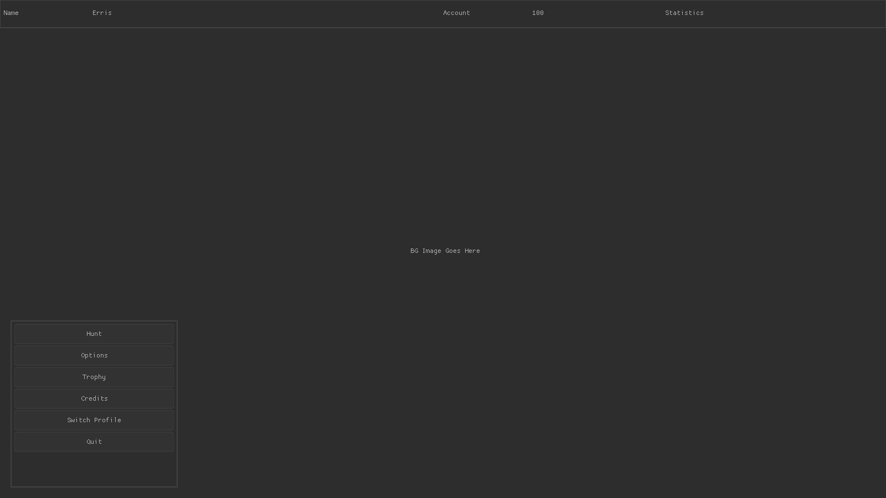
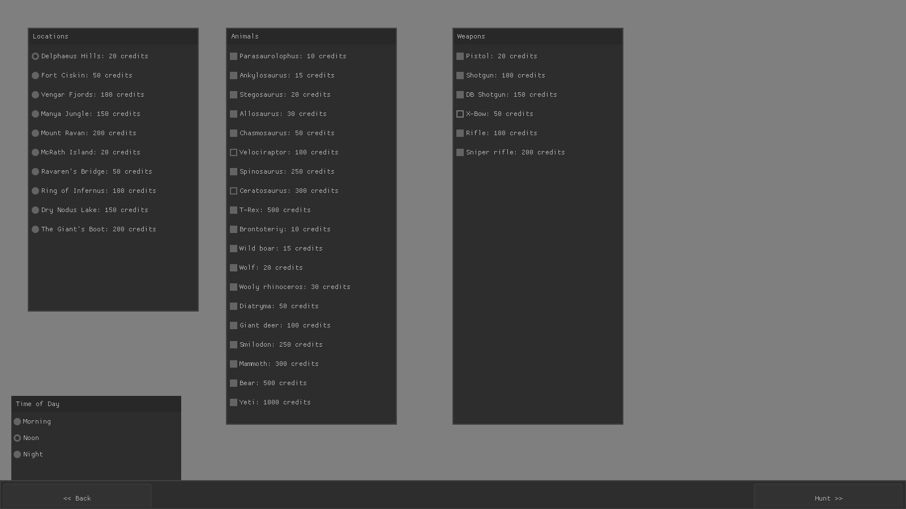
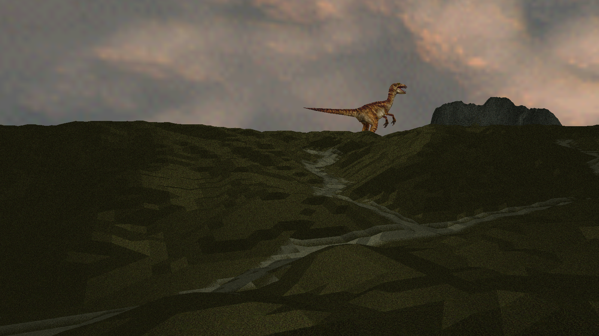
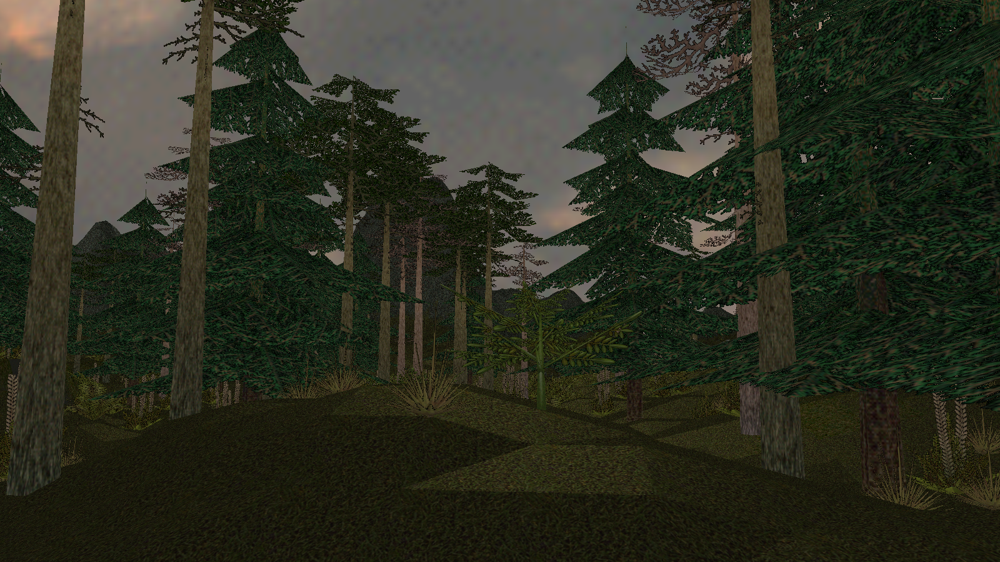

# Predation

Open Source Alternative to Carnivores2

In order to run this, you will need your own copy of Carnivores2 / Ice Age. The first 
time `predation` runs, it'll ask for the path to the HUNTDAT folder. These can manually 
be set by creating or modifying `resources/assets.txt`

## Media

WIP Home Screen

Hunt Setup Screen

Active Hunt

## Known Bugs (So Far. Probably more broken things than working ones)
- Very jagged terrain. Not sure how to smooth yet
- no dinosaurs rendering
- camera is still attached to Hunt.cpp instead of the Hunter.cpp, although work has started
- credits are not implemented yet, so all maps, dinos and guns are available
- view range is hardcoded. needs added to GameSettings and given a control in the options screen.
- add AABB collision bugs
- Delpheus Hills: radio tower is mis-placed and missing midpiece.
- mouse state updates to rapidly, resulting in toggling weapons really fast; should switch to a latch mechanism

## Todos
- Add Uniform Buffer Objects to the shaders, so we have unified uniforms
- Implement AI (hooo boy is this a big one)
- Render animations for models. Data is available, but haven't programmed the adapter yet
- Add sounds from map and dinosaurs

## Style Guide Rules
- Any variables declared on the heap MUST use smart pointers (shared_ptr is preferred)
- Prefer stack allocated variables (ie `GLushort texture[256 * 256];` instead of `GLushort* texture = new GLushort[256 * 256]`)
- Use STL containers instead of pointer arrays `std::vector<GLushort> texture(size);` instead of `GLushort texture[size];`